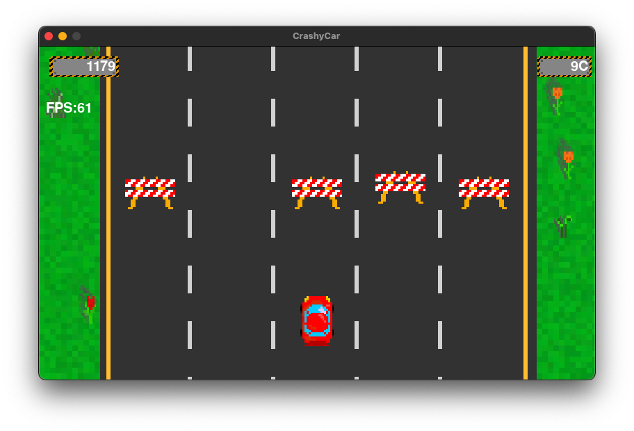
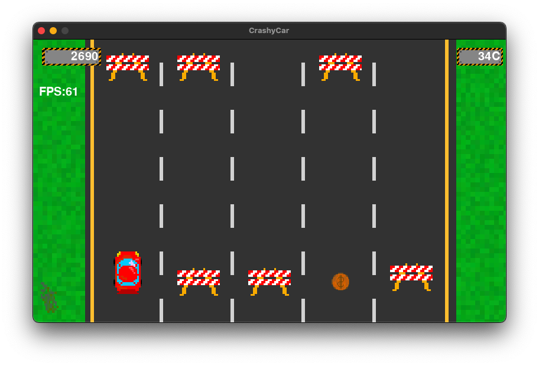
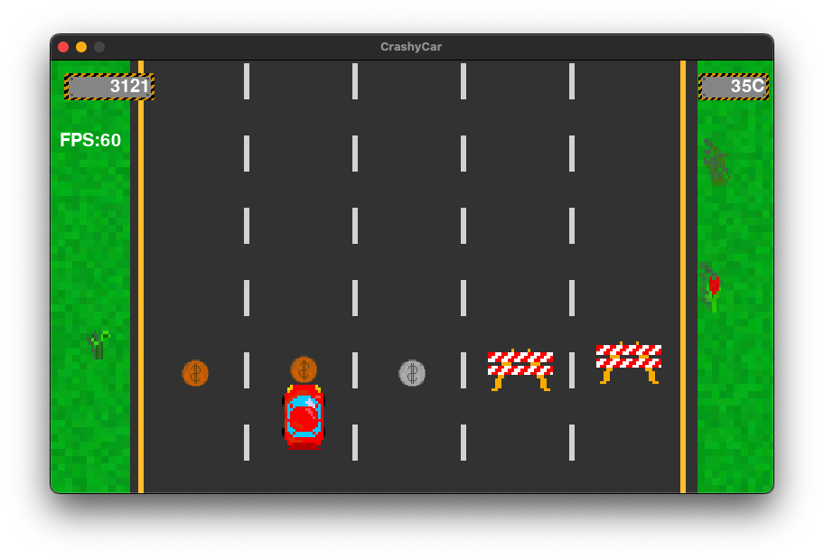
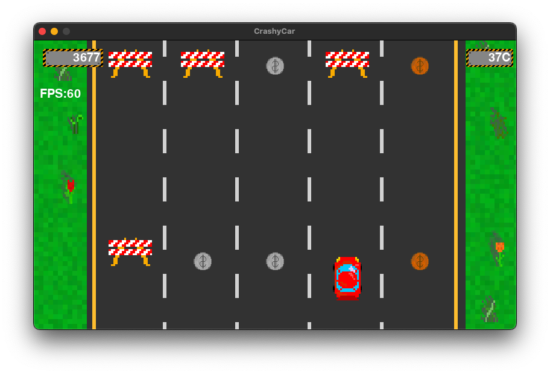
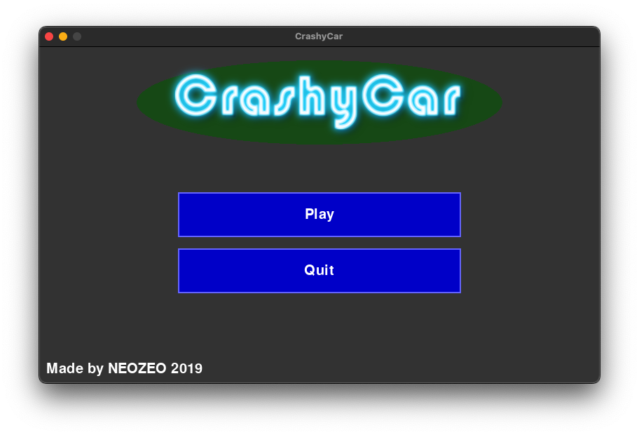
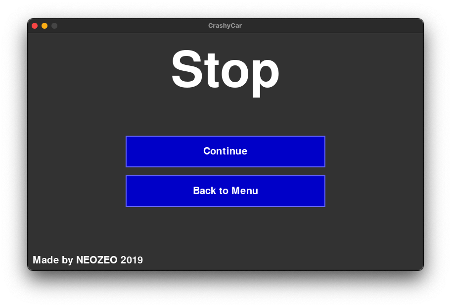

# CrashyCar

This is also an old project started in school, built with python & pygame.

I got the idea from popular standard old Jump and Run phone games like Subway Surfers or Temple Run. In this game, you need to drive your car through obstacles while collecting as much coins as possible. Controls are just the keys A & D. Have fun!

To start it, install `python` and `pygame` and run the game from its directory e.g. with `python crashycar.py`

## Gallery

#### Game

#### Menu

